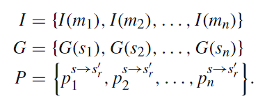

# Blockchain Meets IoT: An Architecture for Scalable Access Management in IoT

****

除了物联网设备本身的资源首先之外，当前基于**集中式**和**分层架构**的访问控制系统都在物联网领域提出了新的挑战

集中式访问控制系统（也称为客户端/服务器范例）旨在满足传统的**面向人机**的互联网场景的需求，其中设备位于同一信任域内，这通常需要集中式访问管理

然而，一些物联网场景比传统场景更具**动态性**，其中物联网设备可能是移动的并且**在其生命周期内属于各种管理社区**

另一方面，物联网设备可以由**多个管理者同时管理**

****

该文提出的方案的优点

* 移动性
  
  该架构可用于隔离的管理系统或域。因此，每个管理域都有自己管理物联网设备的自由，而访问控制策略仍然由区块链中的规则强制执行

* 可访问性
  
  在某些物联网系统中，受限管理人员可能会使用睡眠模式，这使得不断直接访问它们是不可行的。该解决方案使访问控制规则随时可用。此外，一些管理服务器的故障不会破坏对信息的访问；所有访问控制信息均已分发

* 并发
  
  一台受限设备可以同时拥有多个管理器，它们都可以同时访问或修改访问控制策略

* 轻量级
  
  物联网设备不需要任何修改即可采用我们的解决方案。此外，管理者和物联网设备之间的通信是通过区块链网络实现的，从而实现跨平台通信

* 可扩展性
  
  受限管理器仍然可以使用我们的解决方案处理多个物联网设备，因为物联网设备不直接从管理器访问访问控制信息。此外，我们的解决方案支持通过不同受限网络连接到单个区块链的众多物联网设备

* 透明度
  
  系统隐藏物联网设备的位置以及资源的访问方式

> 该方案与其他解决方案不同之处在于它应用特定设计以避免将区块链技术集成到物联网设备中
> 
> 与其他解决方案不同，该方案在单个智能合约中运行，简化了区块链网络中的整个流程，减少了节点之间的通信开销

架构不包括区块链中的物联网设备，作为替代，定义了一个称为管理中心（management hub）的新节点，该节点代表物联网设备从区块链请求访问控制信息

> CoAP 协议和 DTLS 协议是什么东西

****

该方案中的角色：

* 无线传感器网络（Wireless Sensor Networks）
  
  由物联网设备组成

* 管理者（Manager）
  
  管理者是负责管理一组物联网设备的访问控制权限的实体。通常，管理器被认为是我们系统中的轻量级节点。轻量级节点不像矿工节点那样存储区块链信息或验证区块链的交易。因此性能受限的设备也能成为管理员
  
  此外，该方案的管理者不需要经常连接到区块链网络，这有助于减少他们的硬件资源的使用
  
  任何实体都能注册为一个管理者，但是一个注册为 IoT 设备的设备必须注册在一个管理者的控制下。这是为了防止管理者在未经允许的情况下将注册到被他们所控制的设备下

* 代理节点（Agent Node）
  
  代理节点是架构中的特定区块链节点，负责在我们的系统中部署唯一的智能合约
  
  代理节点是访问控制系统生命周期内智能合约的所有者
  
  一旦智能合约被区块链网络接受，代理节点就会收到一个地址，该地址用于识别区块链网络内的智能合约
  
  为了与智能合约进行交互，区块链网络中的所有节点都需要知道该智能合约的地址

* 智能合约（Smart Contract）
  
  本文描述的访问管理系统由单个智能合约中定义的操作管理

* 区块链网络（Blockchain Network）
  
  为了简单起见，架构中的区块链网络是私有区块链

* 管理中心（Blockchain Hub）
  
  管理中心是一个接口，它将物联网设备在 CoAP 消息中编码的信息转换为区块链节点可以理解的 JSON-RPC 消息
  
  管理中心直接与区块链节点连接，例如矿工
  
  多个传感器网络可以连接到一个管理中心节点，多个管理中心节点可以连接到同一个区块链节点
  
  物联网设备将只能使用管理中心从区块链请求访问信息
  
  > 这不还是云-边-端的模式吗
  
  管理中心节点不能是受限设备。此类设备需要高性能特性，以便能够为来自 IoT 设备的尽可能多的同时请求提供服务
  
  将 IoT 设备添加到系统后，该设备的管理器节点必须通知特定管理中心节点该设备的凭据，以及通知设备管理中心节点的位置

****

**System Interfaces**

对系统单一智能合约中定义的操作以及管理中心节点用于从区块链查询策略的接口进行更详细的说明

I 表示管理者的公钥集合，I(m) 表示管理者 m 的公钥

G 表示 IoT 设备的公钥集合，G(s) 表示 IoT 设备 s 的公钥

P(s->s'r) 表示公钥 s 对应的 IoT 设备具有访问 公钥 s' 对应的 IoT 设备的 r 资源的权限

****

管理中心（Management Hub）可以自由地请求任何物联网设备的信息，并且几乎可以立即从区块链节点获得结果

> 管理中心成为信息的中继点，如果直接攻击管理中心是否可以直接窃取系统的所有信息？

****

系统运行细节

* 建立管理区块链网络
  
  在此阶段，在区块链网络中创建访问管理系统
  
  在创建区块链网络后，代理节点将智能合约部署到区块链网络中
  
  这个单一的智能合约定义了访问控制管理系统的所有操作
  
  一旦智能合约被接受进入区块链网络，代理节点就会收到智能合约的地址
  
  > manager 和 management hub 如何发现地址? ----> 询问 agent node
  > 
  > 但是在文中的实现中，这些信息采取硬编码的方式
  
  management hub 会连接到最近的可用区块链节点。区块链的所有节点会打开 RPC 端口用于监听来自 management hub 的请求以便让 management hub 连接到区块链节点
  
  management hub 也有方法去找到附近的可用区块链节点，这些信息可以从互联网上的中心化系统中获取，但是在该文的具体实现中采用的是手动配置的方式

* 将管理者和物联网设备注册到系统中
  
  访问管理系统中的任何区块链节点都可以注册为管理者
  
  为了让区块链节点将自己注册为管理者，它需要知道智能合约的地址
  
  为了让区块链节点将自己注册为管理者，它需要知道智能合约的地址。一旦获得该信息，它就可以注册自己，向智能合约中定义的函数 RegisterManager 发送交易
  
  此后，一旦交易成功进入区块链，manager 将收到其注册地址。该地址将识别访问管理系统中的管理员
  
  > 一个 IoT 设备可以注册到多个 manager 的控制下，与 manager 的之策一样，会产生一个注册地址用于标识该 IoT 设备
  > 
  > 按道理来说 IoT 设备在注册到具体的 manager 的时候需要校验 manager 是否已经注册，但是文章中的实现省略了该部分的验证，使得系统在恶意管理器的情况（恶意管理器恶意注册大量 IoT 设备到自己的控制下？这部分有点没看懂）下基本不安全。（但文章的目标是证明可行性而不是安全性）

* 为上述组件定义策略

* 发现策略

****

两个测试

* 测试 management hub 的性能表现
  
  使用 CoAPBench 模拟一堆的虚拟 IoT 设备直接与 management hub 连接
  
  每个虚拟 IoT 设备执行的操作：不断向 management hub 发送查询一个特定 IoT 设备 A 是否具有访问另一个特定 IoT 设备 B 的某个资源的权限
  
  当 management hub 收到请求的时候，发起一个 RPC 请求，从区块链网络中查询到对应的信息并返回给虚拟 IoT 设备
  
  > 评估的标准应该就是 management hub 从收到请求到查询完成并返回数据的延迟

* 测试 IoT 设备的性能表现
  
  测试一个 IoT 设备连接到一个 management hub 的性能
  
  使用 CoAPBench 模拟一堆的虚拟 IoT 设备去访问一个特定 IoT 节点 A 的资源，然后由这个 IoT 设备 A 接着去连接到 management hub 并查询权限
  
  > 大致就是一群虚拟 IoT 设备从一个 IoT 设备 A 中请求资源，A 收到请求后连接到 management hub 查一下权限，并返回数据
  > 
  > 性能的评价标准就是虚拟 IoT 设备发起请求到收到回复的延迟

> WSN : Wireless Sensor Network （无线传感器）
